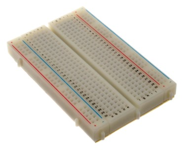
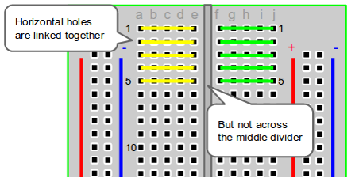
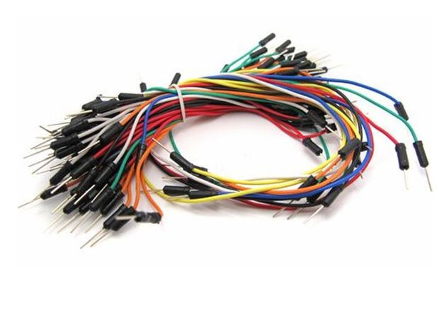
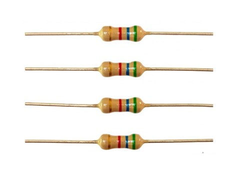
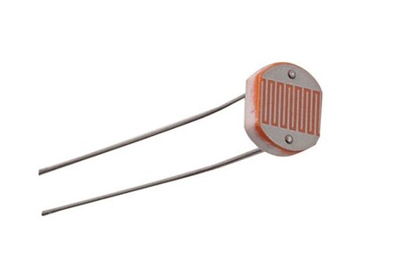

# Introduction - Material

During this workshop we'll be using the following material:

* Breadboard
* Jumper cables
* Resistor
* Photoresistor

## Breadboards

### How do breadboards work? 
Breadboards are one of the most fundamental pieces when learning how to build circuits. In this tutorial, you will learn a little bit about what breadboards are and how to use one.

### Why use breadboards?

An electronics breadboard (as opposed to the type on which sandwiches are made) is actually referring to a solderless breadboard. These are great units for making temporary circuits and prototyping, and they require absolutely no soldering.

Prototyping is the process of testing out an idea by creating a preliminary model from which other forms are developed or copied, and it is one of the most common uses for breadboards. If you aren’t sure how a circuit will react under a given set of parameters, it’s best to build a prototype and test it out.

For those new to electronics and circuits, breadboards are often the best place to start. That is the real beauty of breadboards – they can house both the simplest circuit as well as very complex circuits.

## Jumper cables

A jumper cable, also known as jumper, is an electrical wire or group of them in a cable with a connector or pin at each end, which is normally used to interconnect the components of a breadboard or other prototype or test circuit, internally or with other equipment or components, without soldering.

Individual jump wires are fitted by inserting their "end connectors" into the slots provided in a breadboard, the header connector of a circuit board, or a piece of test equipment.

## Resistor

### What is a resistor?

Resistors are electronic components which have a specific, never-changing electrical resistance. The resistor’s resistance limits the flow of electrons through a circuit. They are passive components, meaning they only consume power (and can’t generate it). Resistors are usually added to circuits where they complement active components like op-amps, microcontrollers, and other integrated circuits. Commonly resistors are used to limit current, divide voltages, and pull-up I/O lines.

### The Ω

The electrical resistance of a resistor is measured in ohms. The symbol for an ohm is the greek capital-omega: Ω. The (somewhat roundabout) definition of 1Ω is the resistance between two points where 1 volt (1V) of applied potential energy will push 1 ampere (1A) of current.

As SI units go, larger or smaller values of ohms can be matched with a prefix like kilo-, mega-, or giga-, to make large values easier to read. It’s very common to see resistors in the kilohm (kΩ) and megaohm (MΩ) range (much less common to see miliohm (mΩ) resistors). For example, a 4,700Ω resistor is equivalent to a 4.7kΩ resistor, and a 5,600,000Ω resistor can be written as 5,600kΩ or 5.6MΩ.

## Photoresistor

### What is a photoresistor?

A photoresistors are also known as light dependent resistors or LDRs and are often used in circuits where it is necessary to detect the presence or the level of light. Although other devices such as photodiodes or photo-transistor can also be used, LDRs or photoresistors are a particularly convenient electronics component to use. They provide large change in resistance for changes in light level.

In view of their low cost, ease of manufacture, and ease of use, LDRs have been used in a variety of different applications. At one time LDRs were used in photographic light meters, and even now they are still used in a variety of applications where it is necessary to detect light levels. When light falls upon it then the resistance changes. Values of the resistance of the LDR may change over many orders of magnitude the value of the resistance falling as the level of light increases.

It is not uncommon for the values of resistance of an LDR or photoresistor to be several megohms in darkness and then to fall to a few hundred ohms in bright light. With such a wide variation in resistance, LDRs are easy to use and there are many LDR circuits available. The sensitivity of light dependent resistors or photoresistors also varies with the wavelength of the incident light.

LDRs are made from semiconductor materials to enable them to have their light sensitive properties. Many materials can be used, but one popular material for these photoresistors is cadmium sulphide, CdS.

