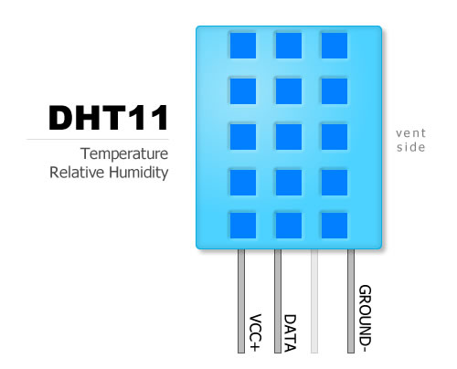
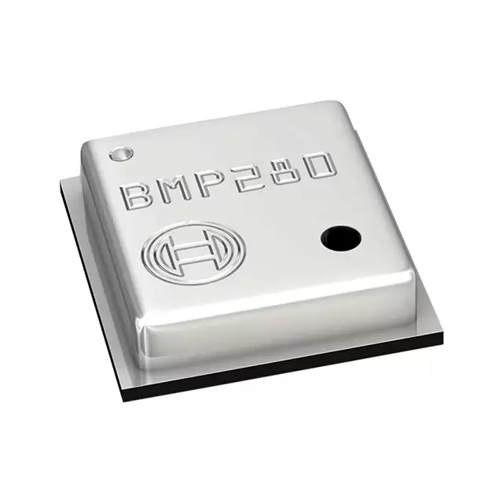
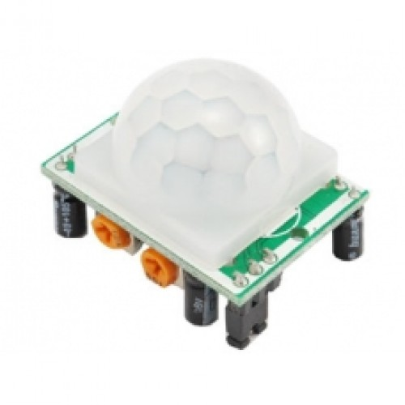

# Introduction - Material

During this workshop we'll be using the following:

* Jumper cables
* Photoresistor
* Temperature Sensor
* Pressure Sensor
* Movement Sensor

## Breadboards

### How do breadboards work? 
Despite we'll not be using them in this workshop, breadboards are one of the most fundamental pieces when learning how to build circuits.

### Why use breadboards?

Breadboards are great for making temporary circuits and prototyping, as they require no soldering.

Prototyping is the process of testing out an idea by creating a preliminary model from which other forms are developed or copied, and it is one of the most common uses for breadboards. If you aren’t sure how a circuit will react under a given set of parameters, it’s best to build a prototype and test it out.

For those new to electronics and circuits, breadboards are often the best place to start. That is the real beauty of breadboards – they can house both the simplest circuit as well as very complex circuits.

## Jumper cables

A jumper cable, also known as jumper, is an electrical wire with a connector or pin at each end, which is normally used to interconnect the components of a breadboard to test the circuit.

Jumpers are fitted by inserting their "end connectors" into the slots provided in a breadboard.

## Resistor

### What is a resistor?

Resistors are electronic components which have a specific, constant electrical resistance. The resistor’s resistance limits the flow of electrons through a circuit. They are passive components, meaning they only consume power (and can’t generate it). Resistors are usually added to circuits where they complement active components like op-amps, microcontrollers, and other integrated circuits. Commonly resistors are used to limit current, divide voltages, and pull-up I/O lines. (Don't worry if you can't understand all of this right now. Everything will be explained further)

### The Ω

The electrical resistance of a resistor is measured in Ohms. The symbol for an Ohm is the greek capital-omega: Ω. The definition of 1Ω is the resistance between two points where 1 volt (1V) of applied potential energy will push 1 ampere (1A) of current.

As SI units go, larger or smaller values of Ohms can be matched with a prefix like kilo-, mega-, or giga-, to make large values easier to read. It’s very common to see resistors in the kilohm (kΩ) and megaohm (MΩ) range (much less common to see miliohm (mΩ) resistors). For example, a 4,700Ω resistor is equivalent to a 4.7kΩ resistor (that can also be represented as 4K7Ω), and a 5,600,000Ω resistor can be written as 5,600kΩ, 5.6MΩ or even 5M6Ω.

## Photoresistor

### What is a photoresistor?

A photoresistors are also known as light dependent resistors or LDRs and are often used in circuits where it is necessary to detect the presence or the level of light. Although other devices such as photodiodes or photo-transistor can also be used, LDRs or photoresistors are a particularly convenient electronics component to use. They provide large change in resistance for changes in light level.

In view of their low cost, ease of manufacture, and ease of use, LDRs have been used in a variety of different applications. In the past LDRs were used in photographic light meters, although they are still used nowadays. When light falls it will increase its electrical resistance giving a nice difference in magnitude so they are very precise. The sensitivity of light dependent resistors or photoresistors also varies with the wavelength of the incident light.

LDRs are made from semiconductor materials to enable them to have their light sensitive properties. Many materials can be used, but one popular material for these photoresistors is cadmium sulphide, CdS. (again, no need to uderstand this last paragraph throughly)

## DHT11 Temperature Sensor

Like the name suggests, this device is able to measure the ambient temperature.

Keep in mind that like all sensors it doesn't give you exactly and trustworthly the real value. Some sensors give you very accurate values that you can trust but it is never exactly the real value. With that being said this sensor is not all that acurate as you will see, so dont strange the odd values.

When analysing sensors it is a good idea to read some of these accuracy and other parameters on its datasheet. For the most times, they are easily found using Google. But we'll spare you that work and just hand it to you.

<a href="https://akizukidenshi.com/download/ds/aosong/DHT11.pdf">DHT11 Datasheet</a>

## BMP280 Pressure Sensor

BMP280 is a very good sensor from Bosch and it mesures pressure very accuratly.

## PIR Movement Sensor

This sensor can detect changes in radiation to detect movement and it is widely used in automatic lights, like in bathrooms and some public places.

[Main Menu](../readme.md) | [Next](./helloworld.md)
