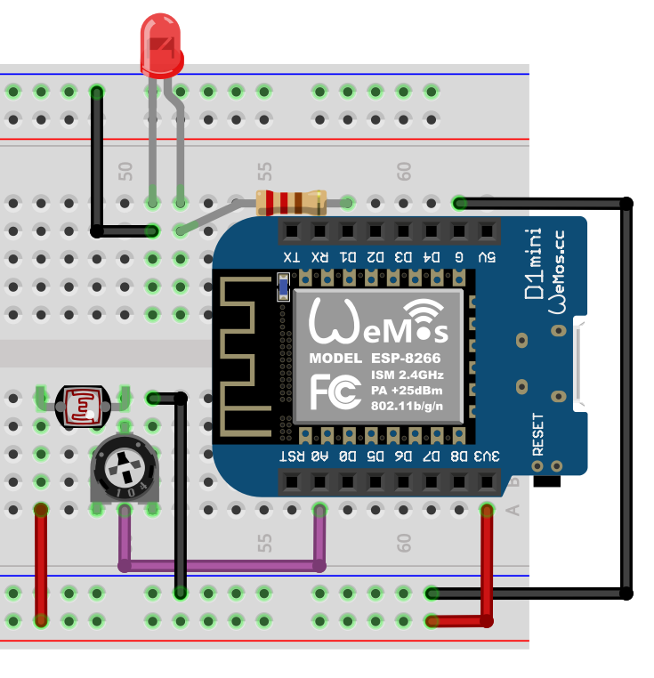
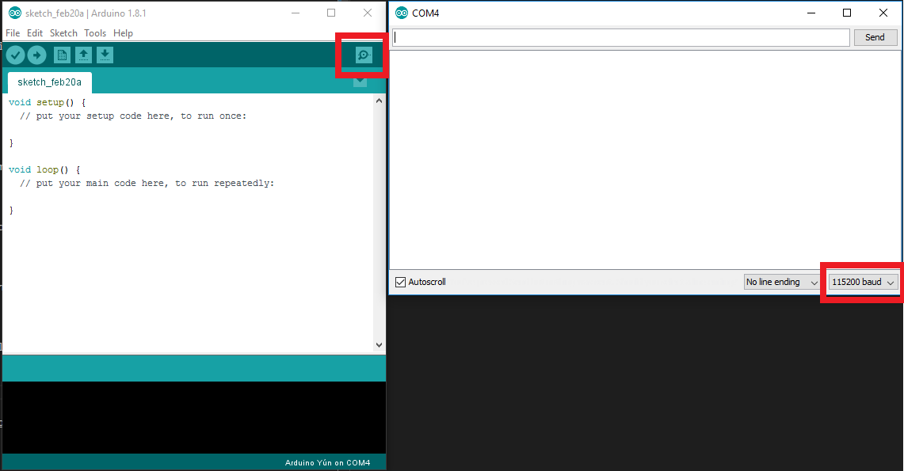

# The Basics - Getting readings from a photoresistor

Now that you know how to program pins, instead of sending data, lets obtain it from a sensor and learn how to use the Serial Monitor!

Ever heard of photoresistors? You have one with you. It simply is a resistor which its value varies according to exposed light. So you can read how much brightness there is and can be useful to manage other components such as turn of and on the LED, and that is what we'll do.



We'll keep the code from the previous exercise and will add a feature to turn on and off the LED based on current brightness.

```Arduino
void setup() {
  Serial.begin(115200);
  pinMode(LED_BUILTIN, OUTPUT);
  pinMode(A0, INPUT);
}

void loop() {
  int brightness = analogRead(A0);

  Serial.println(brightness);

  if(brightness < 800){
    digitalWrite(LED_BUILTIN, HIGH);
  } else{
    digitalWrite(LED_BUILTIN, LOW);
  }
}
```

Let's now uderstand what was done:

## Read an input

### pinMode(PIN, INPUT)

We've already seen this method in the previous exercise but this time we need to initialize our photoresistor logic pin as an input, instead of an output.

### analogRead(PIN)

Similar to what we do to change a value of a digital pin, this method is used to fetch data from a pin. This values vary between 0 and 1023.

## Serial

Serial is a mean of communication used in many connecters we use daily such as USB, Ethernet, Bluetooth, and many others. In this case we'll use Serial communication to see on our computer screen the brightness value that is being read from the photoresistor.

### Serial.begin(BAUD_RATE)

This method is used to initialize Serial communication at a given baud rate (or speed).

### Serial.println(CONTENT_TO_PRINT)

This is used to print a value in a different line. Which means that is equivalent to doing <code>Serial.print()</code> with a <code>"\n"</code> at the end.

### Serial Monitor

To see the Serial values on the screen, all you have to do is click on the Serial Monitor button on the upper right corner of the IDE and <strong>make sure that 115200 is selected</strong> as the baud rate on the bottom of the Serial Monitor window, otherwise you won't be able to tell what is being printed on the screen. (The value should always be the same as the one set in your code)



[Main Menu](../readme.md) | [Next](./pressureAndTemperature.md)
