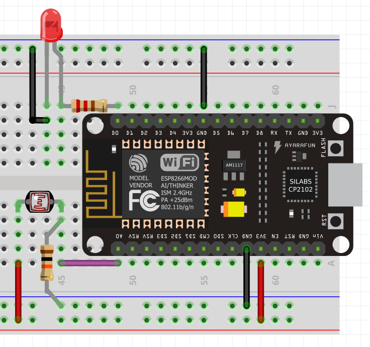

# The Basics - Getting readings from a photoresistor

Now that you know how to program pins, instead of sending data, lets obtain it from a sensor!

Ever heard of photoresistors? You have one with you. It simply is a resistor which its value varies according to exposed light. So you can read how much brightness there is and can be useful to manage other components such as turn of and on the LED, and that is what we'll do.

So because this is an incremental project in respect to the previous one, we'll continue the code we've written before.

WIP

[Back](https://github.com/nuieee/ESP8266-Workshop-Exercises)