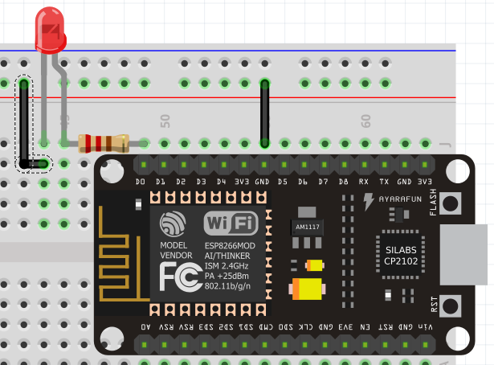

# The Basics - Hello World

So now we'll get our hands dirty! Lets start small by simply making a LED blink.

All we have to do is to connect the longer (positive) pin of the LED to a logic pin of the ESP8266 and the other pin to Ground (GND) as follows:



What we are doing is setting one of the led pins to 0V and the other one it is left to be programmed (wich means that its value will vary). Since there's only electric current when a potencial difference is applied, the LED will only turn on when the logic pin is different than 0V. Furthermore, it was used a resistor to prevent short circuiting the LED and the board itself.

In the image above we've used the logic pin D0 which corresponds to pin number 16 and used a 220 Ω resistor.

Next you have to program it!

```c++
void setup() {
  pinMode(D0, OUTPUT);
}

void loop() {
  digitalWrite(D0, HIGH);
  delay(500);
  digitalWrite(D0, LOW);
  delay(500);
}
```

Let's go through what is happening here.

## void setup()

### pinMode(PIN_IDENTIFICATION, OUTPUT/INPUT)

We've initialized the D0 pin as being an output pin since it will be used to send data rather than receiving it.

## void loop()

### digitalWrite(PIN_IDENTIFICATION, VALUE)

This instruction handles the D0 pin value. Why digital? Because as the name suggests D0 is a digital pin (which means it can only handle HIGH and LOW states, 1 or 0)

### delay(TIME_IN_MILISECONDS)

Finally to make the blinking noticeable we've introduced a delay to make the code wait.

Don't disconnect the LED just yet! Now you're ready to get into the cool stuff!

[Main Menu](../readme.md) | [Next](./ex1.md)