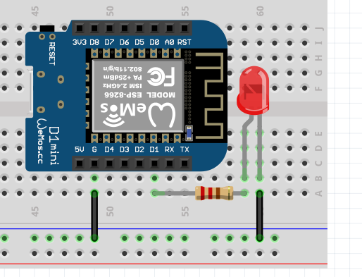
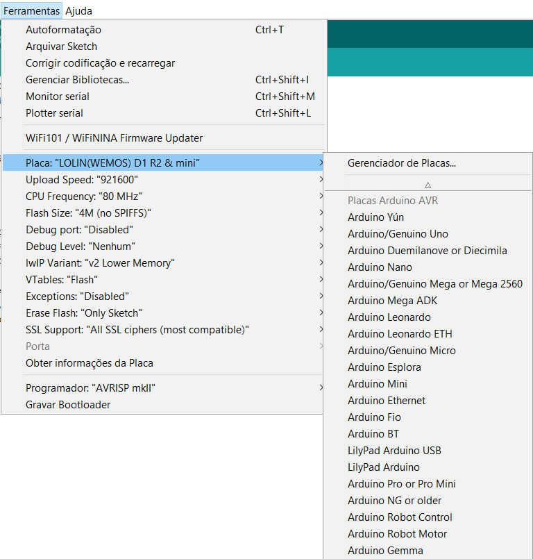

# The Basics - Hello World

So now we'll get our hands dirty! Lets start small by simply making an LED blink.
</br>The ESP8266 comes with an LED already built-in... It might be small and hard to spot, but it will become quite noticeable once you upload some lines of code.

Usually when connecting an LED to the ESP8266, you would need to use an appropriate resistor and connect the terminals accordingly, like so:



Since **we will be using the built-in LED**, all the connections are already in the board itself. But we still need to turn on the LED by applying a pottential difference - also known as **Voltage** - which will create an electric current through the LED. We will do this using some functions, particularly ```pinMode(...)``` and ```digitalWrite(..., ...)```.

Time to do some programming!

```Arduino
#define led_pin LED_BUILTIN

void setup() {
  pinMode(led_pin, OUTPUT);      // Initialize LED_BUILTIN as an output.
}

void loop() {
  digitalWrite(led_pin, HIGH);   // Turn the LED on (HIGH is the voltage level)
  delay(1000);                       // Wait one second (1000ms)
  digitalWrite(led_pin, LOW);    // Turn the LED off by making the voltage LOW
  delay(1000);                       // Wait another second
}
```

While the code is self explanatory, let's go through what is happening here...
> Use comments to make your code easier to understand.</br>Everything you type after **//**  in a single line, or in between **/\* ... \*/** will be ignored by the ESP8266.</br>While it makes no difference for the ESP, it makes a huge difference for any human trying to understand your code (even your future self).

### pinMode(PIN_IDENTIFICATION, OUTPUT/INPUT)

We've initialized the ```LED_BUILTIN``` pin as being an output pin since it will be used to send data rather than receiving it.
</br>You should always use this function before actually trying to output to or read anything from any pin.

### digitalWrite(PIN_IDENTIFICATION, VALUE)

This function is inside ```void loop() { ... }``` so it keeps repeating forever, remember?
</br>In this example, ```digitalWrite( ... )``` handles the value of the ```LED_BUILTIN``` pin.
</br>Why digital? Because ```LED_BUILTIN``` is a digital pin, which means it can only be in one of two states HIGH (1) or LOW (0). Turned on, or turned off, as simple as that.

### delay(TIME_IN_MILISECONDS)

Finally to make the blinking noticeable we've introduced a delay to make the chip wait before executing the next instruction.
</br>This function is useful when dealing with any microcontroller, as you might see later on.

### Before upload the code, remember to select the right board! 

Searc for "LOLIN(WEMOS)D1 R2 & mini" and select it!



## Now, to check if you understood, try lighting up the external LED you just mounted!

[Main Menu](../readme.md) | [Next](./ex1.md)
