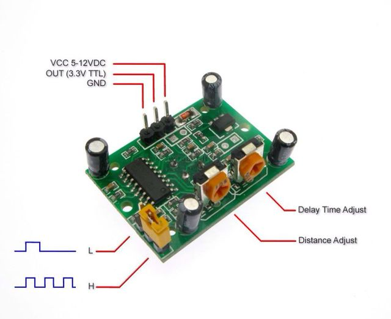

# Move! - PIR Motion Sensor

A PIR or Pyroelectric InfraRed sensor, detects levels of infrared radiation. Everything emits some low level radiation, and the hotter something is, the more radiation is emitted. By detecting sudden changes in infrared levels, this kind of sensor is able to detect movement.
</br>The PIR sensor, while analog, has a built-in chip that does some minor processing, so **it outputs a digital pulse**.

Now let's begin with some conections!

Connect the PIR **VCC** pin to the **5V** pin of the ESP8266, and the PIR **GND** pin to the ESP's **G** pin.
</br>Finally, unlike other sensors we saw until now, the PIR sensor only outputs two values - ```HIGH``` or ```LOW``` - so we can connect it to a digital pin (there's no need to use our only analog pin). So connect **OUT** on the PIR to **D1** on the ESP.
>If you're having trouble distinguishing the pins on the PIR, you can always take off the white housing to read the indications - it comes off easily with a little persistance.



## Programming...

The code for the PIR sensor is rather easy, depending on what you want to make with it.
</br>We'll start by defining the input pins as usual, but this time we will also define some variables we'll need later on.
</br>We also initialize ```Serial``` which, as you saw, is always useful for debugging.

```Arduino
int state, reading;
void setup(){
  pinMode(D1, INPUT);
  state = LOW;         // We'll assume no motion is detected in the begining
  reading = LOW;
  Serial.begin(115200);
  
  Serial.print("\nMotion detection starting at ");
  Serial.print(millis()/(1000*60));
  Serial.print("m"); Serial.print(millis()/(1000));
  Serial.println("s."); Serial.println();
}
```

Now, whenever a motion is detected (```HIGH```) we'll send a message to the Serial monitor.

```Arduino
void loop(){
  reading = digitalRead(D1);
  if (reading != state){  // State has changed, could be movement detection...
    state = reading;
    if (state == HIGH){   // It is movement indeed.
      Serial.print("Motion detected! Timestamp: ");
      Serial.print(millis()/(1000*60));
      Serial.print("m"); Serial.print((millis()%60000)/1000);
      Serial.println("s");
    } else {              // Previous motion stopped
      Serial.print("Motion stopped. Timestamp: ");
      Serial.print(millis()/(1000*60));
      Serial.print("m"); Serial.print((millis()%60000)/1000);
      Serial.println("s");
    }
  }
  delay(50);              // Wait for 50ms. This prevents noise.
}
```

Test this code before moving forward. In the beginning you might experience some false positives/negatives while the PIR sensor is stabilizing. Give it a few seconds.
> **millis()** is a function that returns the number of milliseconds since your board began running the current program.</br>It will take multiple days to go back to zero, so it can be used for timestamps.


[Main Menu](../readme.md) | [Next](./ex2.md)
